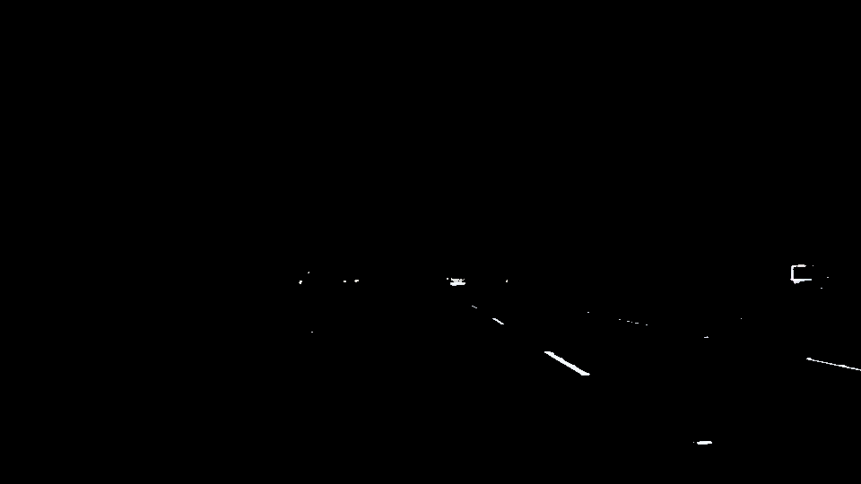
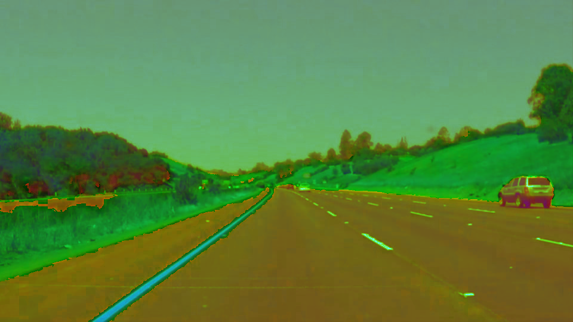
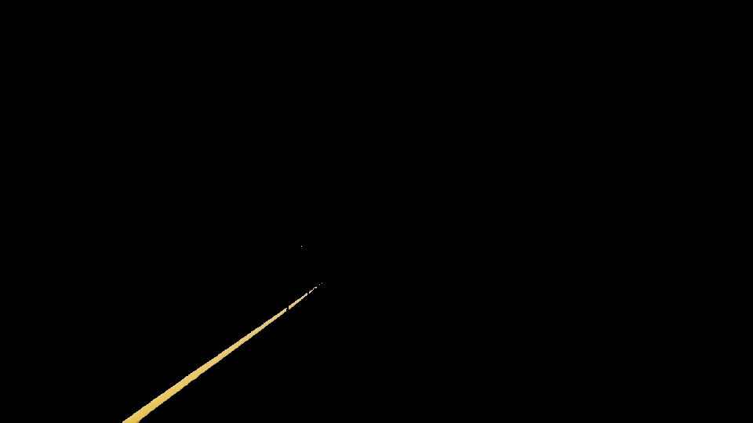
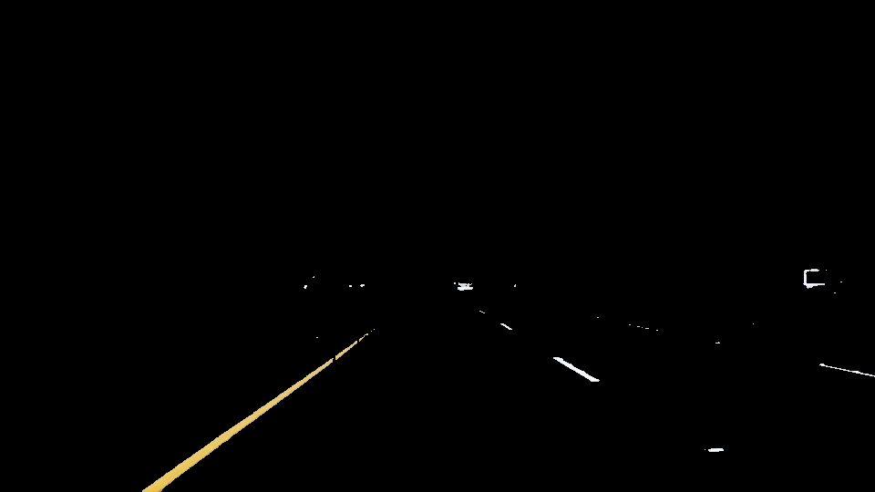
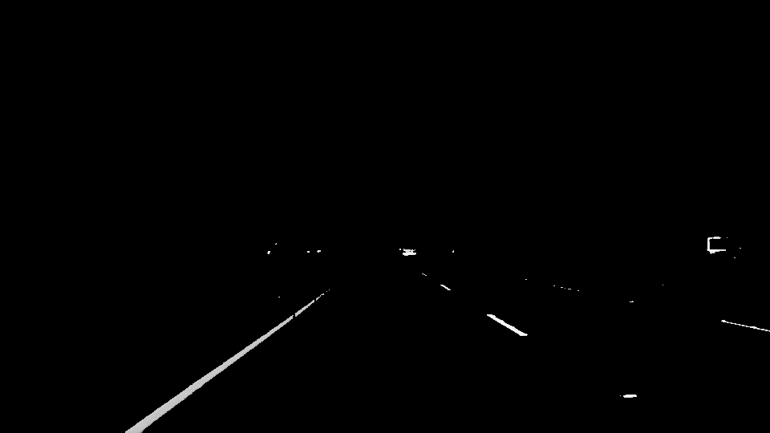
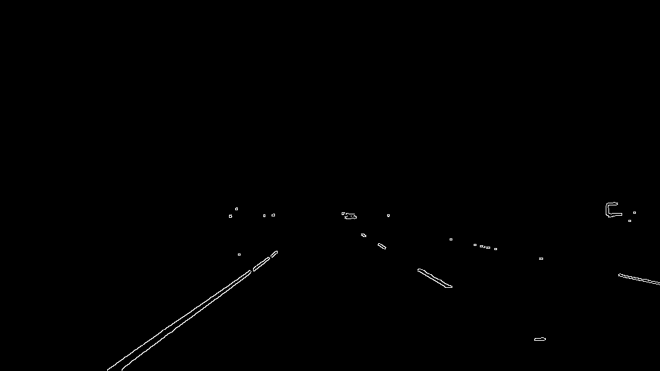
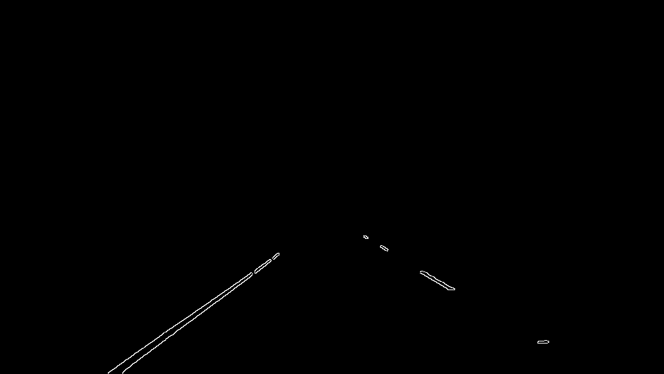
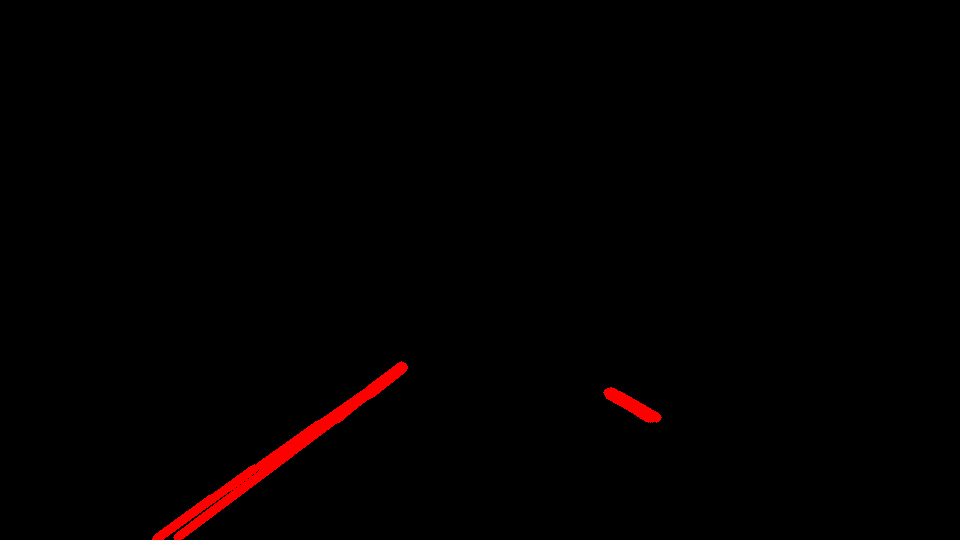
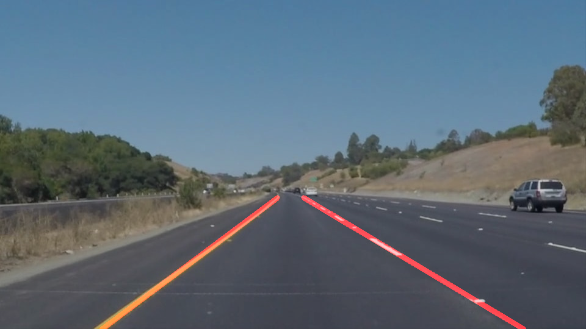

# **Finding Lane Lines on the Road** 

## Michael DeFilippo

### This project was used to introduce the concepts of using OpenCV and the Python programming language to find lane lines on a road. The general idea is to first identify lane lines on a set of images using various computer vision techniques and then apply your lane finding pipeline to actual video of a car driving down a road.  

---

**Finding Lane Lines on the Road**

The pipeline that I designed uses the following techniques to detect lane lines:
  * Color Filtering
  * Canny Edge Detection
  * Region of Interest Selection
  * Hough Transforms and Line Detection
## Pipeline

### Uploading Test Images  
Lane lines were first detected using these techniques on the provided test images. See image below for an example of the test images. 


### Color Filtering
The images are uploaded with OpenCV in RGB (Red, Green, Blue) color space. From there apply a filter to only select the white threshold of the image. Next I convert the original image to HSL color space to more easily detect yellow colors using a yellow threshold. I then apply a filter to the HSL image to select the yellow threshold of the image. Finally I combine the images into one image with only white and yellow color selection.

```python
def color_filter(image):
    ## Filter for the white pixles 
    # Define range of white color
    lower_white = np.array([200, 200, 200])
    upper_white = np.array([255, 255, 255])

    # Threshold the image to get only the white colors
    white_mask = cv2.inRange(image, lower_white, upper_white)
    
    # Bitwise-AND mask and original image
    white_image = cv2.bitwise_and(image,image, mask= white_mask)
    
    ## Filter for the yellow pixles
    # Convert image to HSV
    hsv = cv2.cvtColor(image, cv2.COLOR_RGB2HSV)
    # Convert image to HSL color space for enhanced color detection with shadows 
    hsl = cv2.cvtColor(image, cv2.COLOR_RGB2HLS)
                       
    # Define range of yellow color
    lower_yellow = np.array([20, 100, 100])
    upper_yellow = np.array([30, 255, 255])
    
    #Threshold the image to get only the yellow colors
    yellow_mask = cv2.inRange(hsl, lower_yellow, upper_yellow)
    
    # Bitwise-AND mask and original image
    yellow_image = cv2.bitwise_and(image,image, mask= yellow_mask)
    
    ## Combine (Blend) the images (see OpenCV-Arithmetic Operation on Images tutorial)
    combined_image = cv2.addWeighted(white_image,1.0, yellow_image,1.0, 0)
   
    return combined_image
```



I apply a white thresholding and show that only white is visible in this image.



Here I have converted the original image to HSL color space



I next apply yellow thresholding and show that only yellow is visible in this image. 



The white and yellow lines can be clearly identified in this photo. 


### Canny Edge Detection
Next I filtered the image using Canny edge detection techniques using OpenCV functions in the following order to the final image of the color filtering process. 
   * Grayscale
   * Gaussian Blur
   * Canny Edge Detection
   
```python
def grayscale(img):
    """Applies the Grayscale transform
    This will return an image with only one color channel
    but NOTE: to see the returned image as grayscale
    (assuming your grayscaled image is called 'gray')
    you should call plt.imshow(gray, cmap='gray')"""
    return cv2.cvtColor(img, cv2.COLOR_RGB2GRAY)
    
def gaussian_blur(img, kernel_size):
    """Applies a Gaussian Noise kernel"""
    return cv2.GaussianBlur(img, (kernel_size, kernel_size), 0)
  
def canny(img, low_threshold, high_threshold):
    """Applies the Canny transform"""
    return cv2.Canny(img, low_threshold, high_threshold)
  
```


First I converted the color filtered image to grayscale. 


Next I applied a Gaussian blur to the grayscale image with a kernel size of 5.



I finished the process by applying a Canny edge detector to find the lines in the image. The goal is to find a setting of thresholds that detect enough edges in the image. I settled on a low threshold of 50 and a high threshold of 150 for the Canny edge detector function. The documentation in OpenCV references the selection of a threshold ratio between 3:1 or 2:1 (upper:lower).

### Region of Interest
I next selected a region of interest in the image such that only the lane lines would be detected. This was useful because there are many other items of color in the image that we do not want to worry about.  Using the OpenCV cv2.fillPoly() function I was able to define a polygon defined by vertices.

```python
def region_of_interest(img, vertices):
    """
    Applies an image mask.
    
    Only keeps the region of the image defined by the polygon
    formed from `vertices`. The rest of the image is set to black.
    """
    #defining a blank mask to start with
    mask = np.zeros_like(img)   
    
    #defining a 3 channel or 1 channel color to fill the mask with depending on the input image
    if len(img.shape) > 2:
        channel_count = img.shape[2]  # i.e. 3 or 4 depending on your image
        ignore_mask_color = (255,) * channel_count
    else:
        ignore_mask_color = 255
        
    #filling pixels inside the polygon defined by "vertices" with the fill color    
    cv2.fillPoly(mask, vertices, ignore_mask_color)
    
    #returning the image only where mask pixels are nonzero
    masked_image = cv2.bitwise_and(img, mask)
    return masked_image
    
# Region of Interest Vertices
imshape = image.shape  # find the max X and Y axis of the image where 0,0 is the top left
ysize = imshape[0] # pixel 540
xsize = imshape[1] # pixel 960
#print (xsize,ysize)
vertices = np.array([[(0, ysize), (450, 330), (510, 330), (xsize, ysize)]], dtype=np.int32)
```



It is clear from the picture above that the only region that is now shown are where the lane lines are located. 

### Hough Transform and Line Detection
I used the cv2.HoughLinesP() function in OpenCV to return an image with the hough lines drawn. I had to tune the associated parameters that are used with the function. The parameters and descriptions are shown below. 

```python
# Hough Transform
rho = 2 # distance resolution of the accumulator in pixels
theta = np.pi/180 # angle resolution of the accumulator in radians
threshold = 20 # accumulator threshold parameter
minLineLength = 20 # min line length
maxLineGap = 13 # mx allowed gap between points on the same line to link them

def hough_lines(img, rho, theta, threshold, min_line_len, max_line_gap):
    """
    `img` should be the output of a Canny transform.
        
    Returns an image with hough lines drawn.
    """
    lines = cv2.HoughLinesP(img, rho, theta, threshold, np.array([]), minLineLength=min_line_len, maxLineGap=max_line_gap)
    line_img = np.zeros((img.shape[0], img.shape[1], 3), dtype=np.uint8)
    draw_lines(line_img, lines)
    return line_img

```



This photo shows that there are multiple lines detected in the image. 

### Average/Extrapolate Lane Lines
Since the Hough line detection algorithm detects many lines in the image I will extrapolate lane lines based on what was detected. I first find the slope of each line and figure out if this is a left or right lane line detection. I use the equation of a line to find the endpoints of each line. I finally average all of the lines together and plot each line based on the averages.

```python
    # Filter out outlier slopes
    culled_lines = []
    for line in lines:
        for x1, y1, x2, y2 in line:
            if x2 - x1 == 0:
                slope = 1000
            else:
                slope = (y2 - y1) / (x2 - x1)
            
            # Filter out slopes that cause the line to skew
            if abs(slope) > 0.55:
                culled_lines.append(line)
                
    lines = culled_lines
    
    # Find lane lines from x1, x2, y1, y2
    l_x1 = []
    l_x2 = []
    r_x1 = []
    r_x2 = []
    y_min = int(img.shape[0])  # = y-pixel 540
    y_max = int(img.shape[0]*0.6) # = y-pixel 324 apx to the edge of bound box
    center = img.shape[1]/2      # center x-pixel
    # y = m*x + b --> x = (y - b)/m
    for line in lines:
        for x1, y1, x2, y2 in line:
            if (y2 - y1) / (x2 - x1) < 0 and x1 < center and x2 < center:    # If slope is < 0 and on the left half of the image then assign to left lane
                m, b = np.polyfit([x1, x2], [y1, y2], 1) # 
                # find endpoints for x1 and x2
                l_x1.append(np.int((y_min - b)/np.float(m)))
                l_x2.append(np.int(np.float((y_max - b))/np.float(m)))
               # print ('l_x1', l_x1)
               # print ('l_x2', l_x2)
               # print ('l_m', m)
               # print ('l_b', b)
                
            elif (y2 - y1) / (x2 - x1) > 0 and x1 > center and x2 > center:    # If slope is > 0 and on the right half of the image then assign to right lane
                m, b = np.polyfit([x1, x2], [y1, y2], 1) # fit line 
                r_x1.append(np.int(np.float((y_min - b))/np.float(m)))
                r_x2.append(np.int(np.float((y_max - b))/np.float(m)))
               # print ('r_x1', r_x1)
               # print ('r_x2', r_x2)
               # print ('r_m', m)
               # print ('r_b', b)
            
            

    l_x1_avg = int(np.mean(l_x1))
    l_x2_avg = int(np.mean(l_x2))
    r_x1_avg = int(np.mean(r_x1))
    r_x2_avg = int(np.mean(r_x2))
        
    cv2.line(img, (l_x1_avg, y_min), (l_x2_avg, y_max), color, thickness)
    cv2.line(img, (r_x1_avg, y_min), (r_x2_avg, y_max), color, thickness)
```


Here we see the final product of the laneline drawing pipeline

### Applying The Pipeline to Video
Next I apply the pipeline to the following videos.


### Conclusion
This was a really great project to get an introduction into OpenCV and Python by detecting lane lines. This was the first OpenCV project that I have ever worked on and it was really fun learning what this open source tool can do.
 
The algorithm looks to be working perfect up until you apply the pipeline to the videos. It is clear from the videos that this is a basic algorithm that only detects straight lines on flat roads. I have a feeling that in the future there will be an advanced lane finding technique that needs to be applied to hilly roads or sharp corners. 

